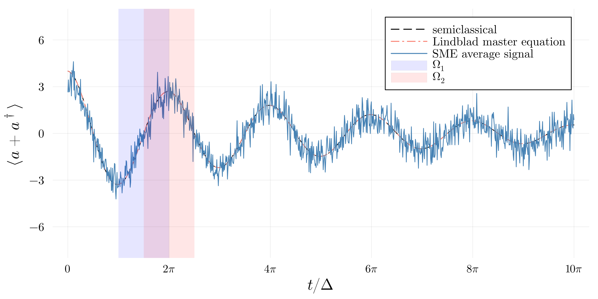

# Example code for the paper *Correlation functions for realistic continuous quantum measurement*

This repository gives an example Julia implementation of the numerical method proposed in the paper *Correlation functions for realistic continuous quantum measurement*.

The code to compute the two-point correlation function of the signal integrated on constant overlapping windows is self-contained in the [`binned-theory.jl`](./binned-theory.jl) script. The Jupyter notebook [`leaky-cavity.ipynb`](./leaky-cavity.ipynb) gives an example on a toy model (a leaky cavity monitored by a diffusive SME in a rotating frame, see figure below).

**Dependencies** Only the [`KrylovKit.jl`](https://github.com/Jutho/KrylovKit.jl) library is required to run the [`binned-theory.jl`](./binned-theory.jl) script. Other libraries are required for the example notebook, see [`Project.toml`](./Project.toml) for the complete list.

**Python?** If you are looking for a Python implementation feel free to contact me.

***

Monitoring the $X$ quadrature of a leaky cavity in a rotating frame.
